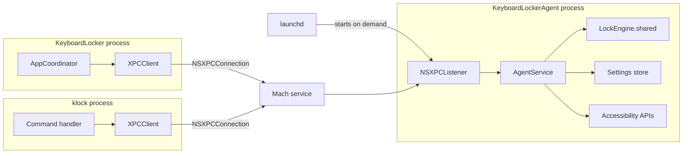
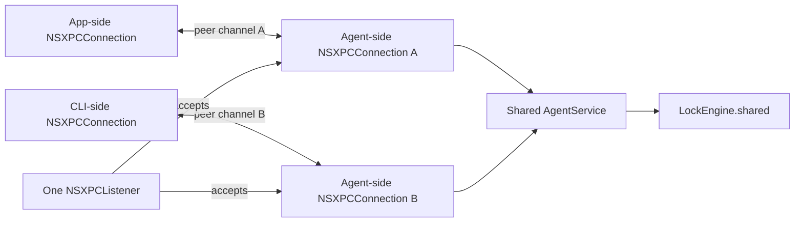
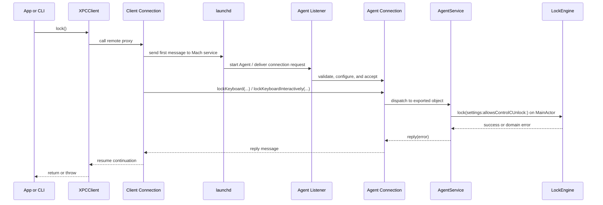
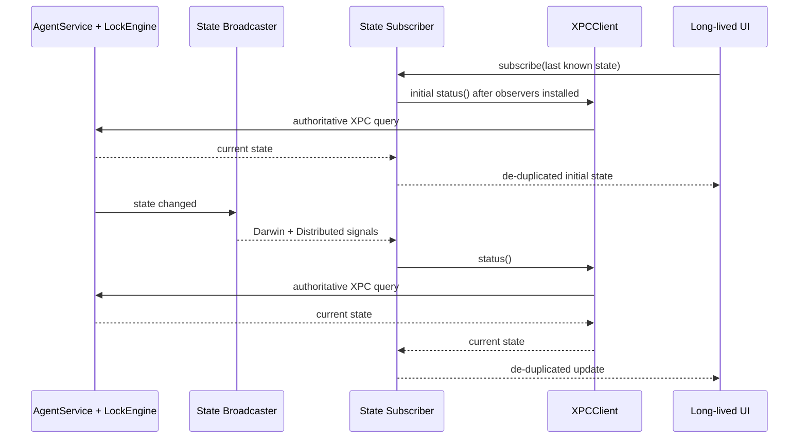

# XPC 实现与使用指南

本文解释 KeyboardLocker 当前的 XPC 实现：`Core` 为什么同时出现在 wrapper 和 Agent 的依赖图里、一次调用如何跨进程执行、锁状态如何同步，以及连接或 Agent 异常时应该如何理解系统状态。

三份文档各自只负责一个层次，避免形成重复的事实源：

- [architecture.md](architecture.md)：解释为什么必须是单 Agent、哪些架构边界不可违反。
- 本文：解释 XPC 在当前实现里如何工作。
- [development.md](development.md)：提供组件索引和常见修改步骤。

## 先记住四个结论

1. **`Core` 不是进程，也不是后台服务。** 它只是一个本地 Swift Package，构建时向不同 executable 提供代码模块。
2. **两侧共享的是协议和数据定义，不是内存或单例。** `Common` 会编译进 wrapper 和 Agent，但唯一的锁状态只存在于 Agent 进程的 `LockEngine.shared` 中。
3. **wrapper 与 Agent 没有互相直接调用 Swift 对象。** wrapper 取得的是 `KeyboardLockerServiceProtocol` 的远程 proxy；macOS 把方法参数和 reply 序列化后跨进程传输。
4. **XPC connection 不拥有锁。** connection、App 或 CLI 退出后，锁仍由 Agent 持有；只有显式/自动 unlock、解锁热键或 Agent 退出才会释放 event tap。

源码中的几个名字处在不同抽象层，阅读时可以这样理解：

| 名字 | 实际含义 |
|---|---|
| `Core` | 容纳三种 library product 的 Swift Package；不是“正在运行的核心” |
| `Common` | Client/Agent 两侧共同理解的 wire contract 与 value definitions |
| `Client` | wrapper 侧的 outgoing XPC adapter |
| `Service` | Agent 侧的 domain/runtime library；它本身不是进程 |
| `AgentService` | 把 wire method 转成 domain call 的 exported object |
| `KeyboardLockerAgent` | 真正运行 listener、持有 event tap 和全局状态的 executable/process |

## 构建依赖和运行进程是两张不同的图

### 构建时：`Core` 提供三个 library product

`Core/Package.swift` 定义三个独立 product：

```text
Core
├── Common
├── Client  -> Common
└── Service -> Common

KeyboardLocker      -> Client  -> Common
klock               -> Client  -> Common
KeyboardLockerAgent -> Service -> Common
```

Xcode 会按 package 名把这些 dependency 都显示在 `Core` 下面，因此看起来像 App 和 Agent “都引用了 Core”。但 target 实际链接的是不同 product：主 App 和 `klock` 只链接 `Client`，Agent 只链接 `Service`；没有 target 把整个 package 的全部代码一起引入。

它们的职责是：

| Product | 被谁链接 | 内容 | 不包含什么 |
|---|---|---|---|
| `Common` | `Client`、`Service` | XPC 协议、Mach service 名、通知名、跨进程值类型 | connection、listener、锁状态、event tap |
| `Client` | App、CLI | `NSXPCConnection`、async 封装、状态订阅 | `LockEngine`、设置存储、Accessibility 执行 |
| `Service` | Agent | listener connection 配置、访问控制、锁引擎、设置真相源、状态广播 | App UI、CLI 命令、客户端 connection |

`Client/Exports.swift` 和 `Service/Exports.swift` 使用 `@_exported import Common`，所以 App 只写 `import Client`、Agent 只写 `import Service`，也能看到 `Common` 中的类型。这只是 import 便利，不会让 App 获得 `Service`，也不会让两边共享内存。

### 运行时：真正存在的是三个独立进程



`Core` 不会作为第四个进程出现。它的代码分别被链接进上图中的 executable：

- App 和 CLI 各自包含一份 `Client + Common` 代码。
- Agent 包含一份 `Service + Common` 代码。
- 只有 Agent 的 executable 包含 `LockEngine`，因此 App/CLI 不可能绕过 XPC 直接操作 event tap。

## `Common` 为什么必须同时存在于两侧

XPC 两侧必须对“线上消息长什么样”达成一致。当前契约定义在 `Common/Shared.swift`：

```swift
@objc(KeyboardLockerServiceProtocol)
public protocol KeyboardLockerServiceProtocol {
  func serviceDescriptor(reply: @escaping (Data?, Error?) -> Void)
  func lockKeyboard(reply: @escaping (Error?) -> Void)
  func lockKeyboardInteractively(
    reply: @escaping (_ didAcquireLock: Bool, _ error: Error?) -> Void
  )
  func unlockKeyboard(reply: @escaping (Error?) -> Void)
  func status(reply: @escaping (Bool, Error?) -> Void)
  func lockStatusSnapshot(reply: @escaping (Data?, Error?) -> Void)
  func prepareForReplacement(
    unlockIfNeeded: Bool,
    expectedAgentInstanceID: UUID,
    reply: @escaping (Data?, Error?) -> Void
  )
  func commitReplacement(
    ticket: Data,
    reply: @escaping (Error?) -> Void
  )
  func replacementStatus(
    ticket: Data,
    reply: @escaping (Data?, Error?) -> Void
  )
  func cancelReplacementPreparation(
    ticket: Data,
    reply: @escaping (Error?) -> Void
  )
  func hasAccessibilityPermission(reply: @escaping (Bool) -> Void)
  func requestAccessibilityPermission(reply: @escaping (Error?) -> Void)
  func currentSettings(reply: @escaping (Data?) -> Void)
  func currentSettingsWithError(reply: @escaping (Data?, Error?) -> Void)
}
```

同一个 protocol 在两侧承担不同角色：

- Client 侧把它交给 `NSXPCInterface`，说明远端 proxy 允许调用哪些 selector。
- Agent 侧由 `AgentService` conform，提供 selector 的真实实现。

这和 HTTP 的 client/server 共同依赖同一份 OpenAPI schema 类似：共享的是消息契约，不是业务实例。

协议使用 `@objc`，因为 `NSXPCInterface` 基于 Objective-C runtime 描述方法。跨边界参数需要是 XPC 可序列化类型；`ServiceDescriptor`、`LockStatusSnapshot` 和设置模型都是 Swift `Codable` struct，所以先编码成有大小上限的 JSON `Data`，到另一侧再解码，而不是把 Swift struct 直接放进 protocol。

## Agent 如何被系统找到

Release App 的关键 bundle layout 是：

```text
KeyboardLocker.app
└── Contents
    ├── Library
    │   ├── LaunchAgents
    │   │   └── io.lzhlovesjyq.keyboardlocker.agent.plist
    │   └── LoginItems
    │       └── KeyboardLockerAgent.app
    └── MacOS
        ├── KeyboardLocker
        └── klock
```

启动链路如下：

1. App 的 `AgentRegistrar` 使用 `SMAppService.agent(plistName:)` 注册 bundled Agent。
2. plist 的 `MachServices` 声明 `io.lzhlovesjyq.keyboardlocker.agent`。
3. 注册成功后，`launchd` 管理 Agent 生命周期。
4. App 或 CLI 向这个 Mach service 发送第一条 XPC message 时，如果 Agent 尚未运行，`launchd` 可以按需启动它。仅创建或 activate connection 不等于 Agent 已经启动。
5. Agent 在 `main.swift` 中创建同名 `NSXPCListener` 并开始接收连接。

这里有两个不同的 readiness 条件：

- `SMAppService.Status.enabled`：系统允许这个 Agent 运行。
- XPC 调用成功：当前 Agent executable 确实启动、接受连接并理解当前 protocol。

前者不是后者的充分条件。例如 App 更新后，系统中可能仍运行旧 Agent；它虽然是 enabled，却不认识新加入的 selector。App 必须通过下方的 descriptor handshake 判断运行中进程,不能从 `SMAppService.Status` 推断版本。

`klock` 自己不注册 Agent。它依赖完整 App 已经完成注册；一旦注册，App 是否仍在运行不影响 CLI 连接 Agent。

## Bootstrap handshake、兼容性和 Agent 更新

`serviceDescriptor` 是 feature method 之前的稳定 bootstrap selector。Agent 每次进程启动生成一次 descriptor：

| 字段 | 用途 |
|---|---|
| `protocolVersion.major/minor` | major 必须相等；running minor 必须不低于 Client 要求 |
| `capabilities` | Client 只调用 Agent 明确声明支持的 optional selector；未知字符串由旧 Client 保留并忽略 |
| `agentBundleIdentifier` | 与 bundled Agent metadata 比较,发现错误/旧 executable |
| `agentVersion` / `agentBuild` | 判断运行中 Agent 是否就是 App 当前携带的构建 |
| `agentInstanceID` | 每个 Agent process 唯一；重启后必须变化,用于区分进程代际 |
| `replacementPending` | 当前是否存在独占的 prepared 或 committed replacement drain |
| `replacementPhase` | additive 的 `inactive` / `prepared` / `committed`;未知 future string 由旧 Client 保留并忽略 |

`agentBundleIdentifier`、version 和 build 是远端自报的兼容性信息,不是安全凭证。它们只有在 connection 已完成 peer authentication 后才有意义；不能用 descriptor 替代代码签名 requirement。

descriptor/capability grant 还必须绑定到读取它的 **同一条 client-side connection generation**。`XPCClient` 的 capability-gated API 会先在一条具体 connection 上读取 descriptor，再用同一个 `NSXPCConnection` 发送 feature selector；若这条 connection interruption/invalidation，Client 会 invalidate 该 object，后续调用以新 connection 重新协商，不能把 Agent A 的 capability grant 用于 Agent B。replacement request 还把 expected `agentInstanceID` 放进 wire message：Agent 在安装 barrier 前原子比较自己的 instance ID，Client 再校验返回 ticket，形成两侧 generation fence。

App 的 readiness 顺序是：

```text
SMAppService enabled
  -> serviceDescriptor()
  -> protocol/capability/bundled-build comparison
  -> status() + hasAccessibilityPermission()
  -> ready application state
```

legacy Agent 没有 `serviceDescriptor`，但 descriptor 调用失败也可能只是 transport 或实现故障，不能仅凭一次失败断言远端版本：

1. Client 失效旧 connection，并在新 connection 上重试一次 `serviceDescriptor`。
2. 两次 descriptor 都失败后，只调用最早就存在的 `status`。
3. `status` 成功只能证明 base contract 可达；App 将远端标记为 unverified，显示 `Agent Update Required`，保留旧 `unlock` 作为安全迁移能力，不调用 Accessibility 等新 selector。
4. `status` 也失败才归类为 unavailable。

运行中 Agent 与 bundled Agent 不一致时,兼容性与更新方向必须分开判断：

- protocol major 不同、identifier 不同或缺少 `lock-control` 时,App 不调用当前 `status`/`prepare` selector,锁状态显示 unknown；只有明确用户动作可以强制 replacement。
- running build 高于 bundled build 时绝不自动降级；UI 可以让用户明确选择是否使用当前 App 携带的版本。
- 只有 identifier 和 protocol major 相同、running `CFBundleVersion` 使用 dotted numeric 规则严格低于 bundled build、并支持 `lock-control + prepare-for-replacement + committed-replacement-drain` 时,才进入自动 upgrade 候选。
- locked 候选绝不自动终止；用户必须明确选择 `Unlock and Replace Agent`。
- unlocked 自动候选调用 `prepareForReplacement(unlockIfNeeded: false)`。Agent 在自己的串行执行边界再次确认 unlocked、安装 barrier,然后返回 `ServiceReplacementTicket`。
- 显式 locked replacement 使用 `unlockIfNeeded: true`；Agent 先安装 barrier 再 unlock,因此不存在 `unlock → prepare` 的跨客户端空窗。
- legacy 或没有 replacement capability 时无法建立 barrier,只能执行带风险说明的用户授权 replacement。

受控 replacement 的顺序是：

```text
prepareForReplacement(unlockIfNeeded:, expectedAgentInstanceID:) -> ownership ticket
  -> short-lived prepared drain rejects every new lock
  -> commitReplacement(ticket)
  -> non-expiring committed drain
  -> await SMAppService.unregister()
  -> register bundled Agent
  -> reset/create Client connection
  -> serviceDescriptor() again
  -> require compatible build and a new agentInstanceID
```

replacement 是两阶段 transaction：

1. `prepareForReplacement` 创建短期、可 cancel/expire 的独占 preparation。它覆盖“已安装 barrier 但尚未向 Service Management 提交 unregister”的窗口；owner 在这里退出不会永久占用 Agent。
2. App 紧接着调用幂等的 `commitReplacement(ticket:)`。commit 只接受同一 Agent instance 的活跃 ticket，并把 drain 切换为不可取消、不可过期的 fail-closed 状态。若 commit reply 丢失，Client 用 `replacementStatus(ticket:)` 查询这个 ticket 的真实 phase；确认 committed 后继续，不凭 transport error猜测结果。
3. 只有收到 commit 成功 reply 后，App 才允许调用 `SMAppService.unregister()`。因此一旦系统中可能存在在途 unregister，Agent 就不会因为 client heartbeat 丢失或任意固定 timeout 而重新接受 lock；barrier 只随旧 Agent 进程退出消失。

Agent 拒绝第二个 prepare，绝不允许新 coordinator 覆盖 ticket。另一份 App 从 `replacementPhase` 区分“等待短期 preparation 到期”和“已 committed、等待旧进程退出”，并周期性重新握手，但不能接管、cancel 或再次 unregister。`SMAppService` 没有暴露可用于 fencing 的 operation token；用固定 grace 让第二 coordinator 再次 unregister，会重新制造“迟到的第一次 unregister 杀死新 Agent”的风险。commit 到 unregister 提交之间仍存在极小的 coordinator crash 窗口；此时设计明确选择 fail closed，旧 Agent 持续拒绝新 lock。若 committed 状态长期不消失，用户需要重启 macOS 完成系统级恢复，而不是由 App 猜测在途操作已经取消。

同一 App 进程对同一个 bundled build 最多发起一次自动 replacement。自动失败、post-restart descriptor 校验失败或新 Agent 仍不兼容时只允许显式重试,避免 App activation/reconciliation 形成 restart loop。post-restart verification 完成前 `activity` 始终保持 updating,其他 reconciliation 只会等待。

## Listener 和 Connection 到底是什么关系

“Agent 是 Listener、wrapper 是 Connection”作为第一层理解是对的，但完整模型是：

- 每个 wrapper 进程主动创建一条 **client-side `NSXPCConnection`**。
- Agent 创建一个 **`NSXPCListener`**，只负责等待、审查并接受新连接。
- Listener 每接受一个 wrapper，Foundation 都会在 Agent 侧创建一条对应的 **server-side `NSXPCConnection`**。
- 业务 method 不经过 Listener delegate；它们在这对 client/server connection 之间传输。



| 对象 | 所在进程 | 当前数量 | 作用 |
|---|---|---|---|
| wrapper-side `NSXPCConnection` | App 或 CLI | `XPCClient.shared` 每个进程通常缓存一条 | 主动找到 Mach service、创建 remote proxy、发送调用、接收 reply/error |
| `NSXPCListener` | Agent | 一个 Mach service 对应一个 | 接收新 connection request，并把每个新 peer 交给 delegate 审查 |
| Agent-side `NSXPCConnection` | Agent | 每个已接受 wrapper 一条 | 暴露 `AgentService`、接收该 wrapper 的 method call、把 reply 发回去 |
| `AgentService` | Agent | 当前整个进程共享一个 | 所有 connection 共用的 wire adapter，保证最终指向同一个全局引擎 |

在当前代码中：

1. `KeyboardLockerAgent/main.swift` 创建一个 `NSXPCListener(machServiceName:)`。
2. Listener 在 activate 前安装 `XPCAccessControl` 生成的 code-signing requirement；不满足 requirement 的 peer 会由 XPC 在调用 delegate 前拒绝。
3. 新客户端通过身份检查后，Listener 才调用 `listener(_:shouldAcceptNewConnection:)`。
4. delegate 通过 `XPCServerConnection.configure` 为 **这条 Agent-side connection** 设置 `exportedInterface` 和 `exportedObject`，然后 activate。
5. 下一位客户端会得到另一条 Agent-side connection，但仍指向同一个 `sharedService`。

因此 Listener 更像 socket server 的 acceptor；接受之后的 peer connection 才像一条已经建立的 socket。不过 XPC 是消息/RPC 系统，不应把它理解成可直接读取任意 bytes 的 TCP stream。

### Client connection 和 Agent connection 不是同一个对象

两侧的 `NSXPCConnection` 是两个不同的 Foundation object：

```text
Wrapper process                           Agent process

clientConnection    <--- XPC/Mach --->    serverConnection
NSXPCConnection                          NSXPCConnection
different object                         different object
different address space                  different address space
```

Client 侧的对象由 wrapper 主动创建：

```swift
let clientConnection = NSXPCConnection(
  machServiceName: SharedConstants.machServiceName
)
```

Agent 侧的对象由 Listener 创建，并作为参数交给 delegate：

```swift
func listener(
  _: NSXPCListener,
  shouldAcceptNewConnection serverConnection: NSXPCConnection
) -> Bool
```

它们不能共享 object identity，也不能直接访问彼此的内存。准确说法是：

- `clientConnection` 和 `serverConnection` 是两个不同的 object。
- 它们分别包装当前进程这一侧的 endpoint 与 peer 状态。
- XPC runtime 把两个 endpoint 关联成同一条双向逻辑 channel。
- 任意一侧退出或 invalidate 会影响另一侧观察到的 connection lifecycle，但这不表示它们是同一个对象。

业务调用的对象映射是：

```text
clientConnection.remoteObjectProxy
                  │
                  │ encoded XPC message
                  ▼
serverConnection.exportedObject
                  │
                  └─ shared AgentService
                           │
                           └─ LockEngine.shared
```

Client 的 `remoteObjectProxy` 也不是 Agent 的 `AgentService`。前者是 wrapper 进程中的本地动态代理；对它调用 method 时，Foundation 才把 invocation 编码并传到 Agent，由后者真正执行。

如果 App 和 CLI 同时连接，会形成两对不同的 connection object：

```text
App clientConnection  <--> Agent serverConnection A ─┐
                                                     ├─> shared AgentService
CLI clientConnection  <--> Agent serverConnection B ─┘
```

所以文档中出现“同一条 connection”时，指的是同一条**逻辑 peer channel**，不是两个进程共享同一个 `NSXPCConnection` 实例。

### `remote` 和 `exported` 是相对于当前进程命名的

`NSXPCConnection` 是双向 channel，两侧拥有同一组配置概念：

| 属性/对象 | 含义 |
|---|---|
| `remoteObjectInterface` | 当前进程准备调用的“对端对象”允许有哪些 method |
| `remoteObjectProxy` | 当前进程中的本地替身；对它调用 method 会产生跨进程 message |
| `exportedInterface` | 当前进程允许对端调用自己的哪些 method |
| `exportedObject` | 当前进程实际接收并执行这些 method 的本地对象 |

当前项目只使用单向业务接口：

```text
Wrapper side
  remoteObjectInterface = KeyboardLockerServiceProtocol
  remoteObjectProxy     = proxy for AgentService
  exportedInterface     = nil
  exportedObject        = nil

Agent side
  remoteObjectInterface = nil
  remoteObjectProxy     = unused
  exportedInterface     = KeyboardLockerServiceProtocol
  exportedObject        = shared AgentService
```

所以 wrapper 侧这句：

```swift
connection.remoteObjectInterface = NSXPCInterface(
  with: KeyboardLockerServiceProtocol.self
)
```

和 Agent 侧这两句：

```swift
connection.exportedInterface = NSXPCInterface(
  with: KeyboardLockerServiceProtocol.self
)
connection.exportedObject = exportedService
```

是在描述同一条 channel 的两端。两端不是共享一个 Swift object；只是对“远端能调用什么”和“本地由谁执行”达成一致。

XPC 本身允许 Agent 反过来调用 wrapper：wrapper 可以设置自己的 `exportedInterface/object`，Agent 再取得 remote proxy。但 KeyboardLocker 没有这样做。全局状态变化使用 payload-free notification 作为刷新信号，再由 wrapper 调 `status()`，避免把状态绑定到某条 client connection。

## 从 Foundation RPC 到 Mach IPC 的分层

当前项目使用的是 Foundation 的 `NSXPCConnection` API。它建立在较低层的 libxpc、Mach IPC 与 `launchd` 服务发现之上：

```text
Project API
  XPCClient.lock()
        ↓
Foundation RPC layer
  NSXPCConnection + NSXPCInterface + remote proxy + NSXPCCoder
        ↓
libxpc layer
  peer connection + opaque XPC message + reply correlation
        ↓
Mach IPC layer
  Mach ports and Mach messages
        ↓
launchd / bootstrap namespace
  service lookup, on-demand process launch, endpoint handoff
        ↓
Agent peer connection
  decode invocation -> AgentService -> LockEngine
```

其中可以依赖的公开语义是：

- XPC connection 是双向 peer channel。
- `NSXPCInterface` 定义允许的 selector、参数/reply 类型和额外 proxy。
- Foundation 自动编码调用参数并在对端解码，再把调用派发给 `exportedObject`。
- 低层 libxpc 发送的是 XPC message，并使用 reply handler 关联响应。
- Mach service name 必须存在于当前进程可访问的 bootstrap namespace，并由 `launchd.plist` 声明。
- `launchd` 可以在第一条消息到达时按需启动 Agent，再把请求交给 Agent listener。

不应依赖的部分是 Foundation/libxpc 的具体 wire bytes、内部 dictionary key、Mach message layout 或私有握手过程。Apple 明确把底层 encoding 和 communication channel 视为 opaque implementation detail；它们不是稳定 ABI，也不应该被持久化或自行解析。

### 一次 proxy method call 在系统里发生什么

以 `XPCClient.status()` 为例：

1. `NSXPCConnection(machServiceName:)` 只创建本地 connection object；此时不验证服务名，也不保证 Agent 已运行。
2. Client 设置 `remoteObjectInterface`、双向 code-signing requirement 和 interruption/invalidation handler，然后调用 `activate()`。
3. Agent-side connection 同样先设置 exported interface/object，再调用一次 `activate()`。
4. `remoteObjectProxyWithErrorHandler` 创建一个本地动态 proxy。它不是 `AgentService` 的引用，也不能直接访问 Agent 地址空间。
5. 对 proxy 调用 `status(reply:)` 时，Foundation 根据 `NSXPCInterface` 检查 selector 与参数形状，并把 invocation 编码成 opaque XPC message。
6. 第一条实际 message 触发 service lookup；如果需要，`launchd` 启动 Agent。
7. Agent Listener 收到 connection request 后，XPC runtime 先执行 Listener 的 code-signing requirement；只有通过的 peer 才会创建 Agent-side `NSXPCConnection` 并进入 delegate。
8. delegate 设置 `exportedInterface/object`、activate connection 并返回 `true`；返回 `false` 会拒绝并 invalidate 它。
9. Foundation 在 Agent-side connection 上解码 invocation，并调用 `AgentService.status(reply:)`。
10. `AgentService` 读取 `LockEngine.shared.isLocked`，再调用 `reply(isLocked, nil)`。
11. 这里的 reply closure 不是把 Client 的 Swift closure 复制到 Agent 执行；它是 Foundation 提供的跨进程 reply capability。调用它会生成响应 message。
12. Client connection 收到响应后，在自己的 connection queue 上执行 reply handler；`XPCClient` 再恢复 Swift continuation。

当前所有 wire method 都是 `Void + reply block` 形式，因此 proxy method 本身是异步发送；真正的业务完成点是 reply 到达，而不是 proxy call 返回。项目没有使用 synchronous proxy，因为同步 IPC 可能无限阻塞调用线程，尤其不适合 UI/main thread。

### Queue 与并发边界

Foundation 当前公开的调度保证包括：

- 每个 `NSXPCConnection` 有自己的 private serial queue，用于 reply、interruption 和 invalidation handler。
- 每个 `NSXPCListener` 有自己的 private serial queue，用于 delegate callback。
- 发给 `exportedObject` 的调用会被串行投递到 non-main queue；业务代码不能假设自己运行在 main thread。
- 不同 wrapper 对应不同 Agent-side connection，因此不要把“单 connection 串行”误解成“整个 Agent 全局串行”。

这解释了 `AgentService.executeOnMainActor` 的必要性：nonisolated XPC adapter 把多个 client connection 的调用切到 `MainActor`；Agent 的 settings、replacement transaction 与 `LockEngine` 状态都受编译器检查的同一隔离域约束，event tap、CFRunLoop 和 timer 的生命周期也收敛到这里。

### Interruption、invalidation 与项目自己的 timeout

三者属于不同层次：

| 事件 | Foundation/XPC 含义 | 当前项目处理 |
|---|---|---|
| interruption | 远端进程退出或 crash；同一个 named connection object 之后可能透明附着到新进程 | 清除缓存并主动 invalidate 该 object；下次调用创建新 connection 并重新握手 |
| invalidation | connection 无法建立或已永久结束；不能再收发消息 | 清除缓存 connection，后续重建 |
| proxy error | 当前 method 无法取得 reply | 恢复对应 continuation 并抛错 |
| 5 秒 timeout | 项目自己加的上层 deadline，不是 Foundation 自动提供 | 让本 connection 失效；mutation 再查询权威状态 |

Foundation 保证带 reply 的 proxy call 最终调用 reply handler 或 error handler 之一。项目的 `ResumeOnce` 还要处理自定义 timeout 与这两个 callback 的竞争，确保 Swift continuation 仍然只恢复一次。

## 一次 `lock` 调用如何跨进程



对应源码中的实际步骤是：

1. App 的 `AppCoordinator` 已在 readiness reconciliation 中完成 descriptor handshake,随后 App 调用 legacy `XPCClient.shared.lock()`；CLI 的 `klock lock` 使用 capability-gated `lockInteractively()`，原子取得 acquired/already-locked outcome。
2. `XPCClient.currentConnection()` 创建或复用 `NSXPCConnection(machServiceName:)`。
3. Client 把 `KeyboardLockerServiceProtocol` 设置成 `remoteObjectInterface`，再取得 remote proxy。
4. Client 在 activate 前安装只接受同 Team、精确 Agent signing identifier 的 requirement；第一条实际 message 让 `launchd` 按需启动 Agent。
5. Agent Listener 的 requirement 在 delegate 暴露任何方法前校验调用方身份；Client requirement 同时拒绝伪造的 Agent。
6. `XPCServerConnection` 为 Agent-side connection 设置 protocol，并把同一个 `AgentService` 实例设置为 `exportedObject`。
7. 对 remote proxy 的 legacy `lockKeyboard(reply:)` 或 additive `lockKeyboardInteractively(reply:)` 调用被系统编码，通过两侧 peer connection 送达并派发给 `AgentService`。
8. `AgentService` 把领域操作切到 `MainActor`，Agent 可变状态、event tap 和 CFRunLoop 生命周期都在这里维护。
9. `LockEngine.shared.lock(settings:allowsControlCUnlock:)` 检查 Agent 自己的 Accessibility 权限并创建 event tap；strict duplicate 在创建资源前直接返回 already locked。
10. reply 通过 XPC 返回，`XPCClient` 把 callback bridge 成 Swift async/throwing API。

`AgentService` 是 executable target 中的 adapter：它把 wire protocol 翻译成 `Service` 模块里的领域调用。`Service` product 本身不会启动进程；真正创建 listener、保持 RunLoop 的是 `KeyboardLockerAgent/main.swift`。

## 当前 XPC 方法分别表达什么

| Wire method | Client API | 权威执行方 | 语义 |
|---|---|---|---|
| `serviceDescriptor` | `serviceDescriptor()` | `AgentService` | bootstrap query；返回 protocol、capability、bundled metadata 和 process instance ID |
| `lockKeyboard` | `lock()` | `LockEngine` | 严格幂等地进入全局 locked 状态；已锁时直接成功且不修改设置、锁定起点或 auto-unlock deadline |
| `lockKeyboardInteractively` | `lockInteractively()` | `LockEngine` | 原子返回本次请求是否创建全局锁；仅 acquired 的新锁临时接受 `Ctrl+C` 作为额外解锁手势 |
| `unlockKeyboard` | `unlock()` | `LockEngine` | 幂等地解除全局锁 |
| `status` | `status()` | `LockEngine` | 读取 Agent 当前的权威锁状态 |
| `lockStatusSnapshot` | `lockStatusSnapshot()` | `LockEngine` / `AgentService` | capability-gated query；在一个 Agent execution turn 中读取布尔状态、capture time、锁定起点、auto-unlock deadline 与 active settings，并以有大小上限的 format-1 JSON payload 返回 |
| `prepareForReplacement` | `prepareForReplacement(unlockIfNeeded:expectedAgentInstanceID:)` | `AgentService` | Agent 原子校验 expected instance,安装短期 prepared drain,可在同一 execution turn 解锁,返回同 generation ticket |
| `commitReplacement` | `commitReplacement(ticket:)` | `AgentService` | 在提交 unregister 前把 prepared drain 幂等切换为不可过期的 committed drain |
| `replacementStatus` | `replacementStatus(ticket:)` | `AgentService` | 查询 exact ticket 的 inactive/prepared/committed phase,恢复丢失的 commit reply |
| `cancelReplacementPreparation` | `cancelReplacementPreparation(ticket:)` | `AgentService` | 仅在 commit 前由 ticket owner 解除 preparation；committed drain 拒绝 cancel |
| `hasAccessibilityPermission` | `hasAccessibilityPermission()` | `AccessibilityManager` | 查询 **Agent 进程** 当前是否受信任 |
| `requestAccessibilityPermission` | `requestAccessibilityPermission()` | `AccessibilityManager` | 请求系统异步显示 Agent 的授权 prompt；reply 不代表用户已授权 |
| `currentSettings` | protocol 1.1 legacy Client only | `AgentService` | 为既有 selector ABI 保留；编码失败只能返回 `nil` |
| `currentSettingsWithError` | `currentSettings()` | `KeyboardLockerSettingsStore` / `AgentService` | 读取 Agent 持有的设置快照；缺失、损坏、过大或编码失败均显式抛错，不在 wrapper 侧回退默认值 |

Accessibility 调用必须发生在 Agent，因为 TCC 授权绑定到实际使用 Accessibility API 的进程身份。App 获得 Accessibility 权限并不能让 Agent 创建 event tap。

## Connection 生命周期不等于锁生命周期

`XPCClient` 会缓存一条 connection，这是减少重复建连的实现优化，不是业务 session：

- App 和 CLI 各有自己的 connection。
- 某条 connection interruption 后，Client 会将其 invalidate 并清除缓存；invalidation 同样清除缓存。下一次调用创建新 connection 并重新握手。
- App 退出、CLI 退出或 connection 断开，不会触发 unlock。
- `klock lock` 只有在 interactive request 返回 acquired 时才继续等待并打印后续的 `Unlocked.`；该轮锁由 Agent 额外识别并消费 `Ctrl+C` 解锁手势。already locked 表示严格 duplicate no-op,CLI 立即退出,不会解除或修改 App/其他 CLI 建立的锁。直接杀死 CLI 进程仍不会自动解除锁；等待期间 notification subscriber 提供及时更新,周期性 `status()` 提供丢通知与 Agent 重启后的恢复;连续无法取得权威状态时 CLI 报错退出。
- Agent 退出则不同：event tap 属于 Agent 进程，进程退出会由系统释放它，内存中的 locked 状态也会消失。

因此项目刻意没有 `LockSession`、client ownership 或“连接释放时自动 unlock”之类的抽象。领域事实是一个物理键盘对应一个由 Agent 持有的全局状态。

## Reply、超时与“结果未知”

`XPCClient` 用 `withCheckedThrowingContinuation` 把 reply callback 转为 async，并通过 `ResumeOnce` 保证 reply、proxy error、missing proxy 和 timeout 竞争时只恢复 continuation 一次。

所有调用都有 5 秒响应上限：

| 情况 | Client 看到的结果 |
|---|---|
| Agent reply 成功 | async 方法正常返回 |
| Agent reply 领域错误 | 抛出 Agent 返回的错误，例如缺少 Accessibility 权限 |
| proxy 创建或传输失败 | 抛出 transport error / `serviceUnavailable` |
| 5 秒内没有任何结果 | connection 失效并抛出 `timedOut`，或由 mutation API 转换为 outcome unknown |

对 mutation 而言，timeout 不等于“Agent 没执行”。请求可能已经到达 Agent，只是 reply 没有及时返回。因此：

- `lock()` timeout 后通过一条新 connection 查询 `status()`；如果已经 locked，就按成功处理。
- `unlock()` 对称地确认是否已经 unlocked。
- 无法确认最终状态时抛出 `operationOutcomeUnknown`，而不是谎称操作一定失败。
- Accessibility prompt 请求 timeout 同样只表示最终结果未知；不能据此断言 prompt 没有发出。

App 在动作结束后仍会做完整 reconciliation，因为跨进程系统中应以 Agent 的当前查询结果为准，而不是长期相信某次历史 reply。

## 为什么还需要通知

XPC request/reply 适合“现在执行”或“现在查询”，不会自动告诉其他 wrapper 状态后来发生了变化。例如 CLI 锁定后，后续恢复的 App UI 需要更新状态；自动解锁发生时，所有长命 UI 也需要刷新。

当前状态同步链路是：



关键点：

- Darwin 和 Distributed notification 都不携带锁状态，只表达“可能有变化”。
- subscriber 在两个 observer 都安装完成后才发起初始 `status()`；setup 期间发生的变化会被初始查询或 follow-up signal 覆盖。
- 通知可能重复、丢失或乱序，所以 subscriber 收到信号后必须再走 XPC `status()`。
- 同一 subscription 内最多只有一个权威查询 worker；并发信号被合并为后续查询,取消后尚未进入 handler 的在途结果不再交付。
- 两个通知通道是为了提高不同进程状态下的交付可靠性，不是两套状态源。
- 后续 App UI 变为可见或 active 时还必须主动 reconcile，以弥补挂起期间错过的通知。
- 一次性 `status` / `unlock` 命令直接查询 Agent，不需要为了读取当前状态先等待通知。

## Connection 访问控制

身份认证是双向且由 XPC runtime 强制执行：

- Agent 的 `NSXPCListener` 在 activate 前调用 `setConnectionCodeSigningRequirement`，只接受与 Agent 同 Team 且 signing identifier 精确匹配主 App 或 bundled CLI 的 Client。系统在调用 delegate 前完成检查，因此未认证 peer 看不到任何 exported selector。
- App/CLI 的 `NSXPCConnection` 在 activate 前调用 `setCodeSigningRequirement`，只接受与 Client 同 Team 且 signing identifier 精确匹配 bundled Agent 的服务进程。
- requirement 使用 `anchor apple generic`、Apple 签名证书 `subject.OU` 中的 Team ID 和精确 `identifier`；Team ID 从当前进程已经验证的签名动态读取，不在源码中重复硬编码。
- Debug 和 Release 使用同一条安全边界。Xcode Debug target 已配置 Apple Development 签名；unsigned、ad-hoc、错误 Team 或仅伪造 identifier 的进程都会 fail closed。

当前允许的调用方只有主 App 和 bundled CLI 的 namespaced signing identifier；不再接受通用的 `klock` identifier。仅仅知道 Mach service 名称，或在自己的签名中复制 bundle identifier，都不能调用 Agent。descriptor 中的 bundle/version/build 仍只用于兼容性判断，不参与身份认证。

`klock` 是裸 Mach-O command-line tool，因此 target 必须生成并嵌入 `__TEXT,__info_plist`；否则 `PRODUCT_BUNDLE_IDENTIFIER` 不会成为实际 code-signing identifier，`codesign` 会退回可执行文件名 `klock`，并被 Listener requirement 正确拒绝。`CREATE_INFOPLIST_SECTION_IN_BINARY` 和 `GENERATE_INFOPLIST_FILE` 属于 XPC 身份契约，不能当作无关构建设置移除。

## `SMAppService` 状态和 XPC 状态不要混为一谈

| 观察结果 | 含义 | App 行为 |
|---|---|---|
| `.notRegistered` | Agent 尚未注册 | 尝试 `register()`，然后重新读取状态 |
| `.enabled` | 系统允许 Agent 运行 | 继续通过 XPC 查询真实 readiness |
| `.requiresApproval` | 用户需要在 Login Items 批准 | 显示说明和 System Settings 入口 |
| `.notFound` | Service Management 无法解析该 service；既可能是 bundled Agent/plist 缺失，也可能只是当前 App 尚无 Background Task Management 注册记录 | 先独立校验 bundled assets；完整时尝试 `register()` 并以注册后的状态或错误为准，缺失时才报告 bundle layout 错误 |
| enabled + descriptor compatible | 当前进程理解所需 contract 且匹配 bundled Agent | 继续查询 lock / Accessibility readiness |
| enabled + running build lower + same major + replacement capability | 安全自动 upgrade 候选 | unlocked 时每 bundled build 自动尝试一次；locked 时要求用户确认 |
| enabled + running build higher | 旧 App 面对更新 Agent | 禁止自动降级；只提供明确用户 replacement |
| enabled + incompatible major/identity/capability | 当前 selector 语义不能安全假定 | 不查询不受保证的 lock state,显示 unknown 和 forced replacement 风险 |
| enabled + fresh-connection descriptor retry 仍失败 + base `status` success | base contract 可达，但版本无法确认 | 只保留 `status`/`unlock`,显示显式 unverified update |
| enabled + descriptor retry 和 base `status` 都失败 | Agent 未启动、崩溃或连接被拒绝 | 诚实显示不可达；可提供显式 retry/restart |
| enabled + compatible descriptor + `replacementPending` | 存在 prepared 或 committed replacement | 周期性重新握手并显示 replacement in progress；不得接管、cancel 或再次 unregister |

locked Agent 不能自动 restart,因为 Agent 退出本身会释放正在工作的 event tap。只有严格更旧、unlocked、same-major 且支持 ticket barrier 的 Agent 才可受控自动 upgrade；其他情况需要明确用户动作。安全路径必须保持 barrier 直到 `unregister()` 结束,然后清除旧 Client connection 并对新进程重新握手。

## 新增 XPC 能力时的修改顺序

1. 在同一 protocol major 内只允许新增 selector；不得修改/移除既有 selector、参数顺序、类型或 reply 形状。无法长期保留 selector union 的破坏性升级需要新的 Mach service name。
2. 在 `Core/Sources/Common/Shared.swift` 的 `KeyboardLockerServiceProtocol` 增加最小 wire method,在 `ServiceCapability` 增加一个稳定且永不复用的名字,并按需要提高 protocol minor。
3. 只使用 Objective-C/XPC 能表达的参数和 reply 类型；复杂 Swift value 编码成有明确 schema 和大小上限的 `Data`。
4. 在 `KeyboardLockerAgent/AgentService.swift` 实现 protocol adapter,并在 descriptor 声明 capability。
5. 把真实领域行为放在 `Service`，不要堆进 App、CLI 或 wire adapter。
6. 在 `Core/Sources/Client/XPCClient.swift` 增加薄的 async/throwing 封装；调用方先 handshake 并检查 capability。
7. wrapper 只调用 `XPCClient`；App/CLI 不得 import `Service`。
8. 明确方法是 query 还是 mutation，并定义 timeout 后能否确认最终结果。
9. 如果状态可能在调用之外变化，继续用“notification signal + XPC query”，不要把通知 payload 变成第二个状态源。
10. 在 `Core/Tests/ClientTests` 覆盖 descriptor round-trip、major/minor、unknown capability、missing capability 与 bundled build mismatch。

## 常见误解

### “Core 被两侧引用，所以是不是有两份锁状态？”

不是。两侧都能看到的是 `Common` 契约；`LockEngine` 位于只有 Agent 链接的 `Service` product。App/CLI 进程里根本没有 `LockEngine` 实例。

### “`Service` product 就是 XPC 后台进程吗？”

不是。`Service` 是 library product。`KeyboardLockerAgent` 才是 executable；它创建 listener，并把 `Service` 中的能力暴露给 XPC。

### “XPC connection 断开时会自动解锁吗？”

不会。锁属于 Agent，不属于 connection。只有 unlock、自动解锁、解锁热键或 Agent 进程退出会释放锁。

### “通知已经告诉我状态，为什么还要调用 `status()`？”

因为跨进程通知不是可靠、有序的状态存储。这里的通知只是刷新提示，Agent 的 `status()` 才是权威事实。

### “主 App 请求 Accessibility 权限不就够了吗？”

不够。创建 event tap 的是 Agent，必须由 Agent 自己查询和请求对应权限。

## 源码导航

| 想理解什么 | 入口 |
|---|---|
| Wire protocol、Mach name、allowlist | [`Core/Sources/Common/Shared.swift`](../Core/Sources/Common/Shared.swift) |
| Descriptor、protocol version、capability | [`Core/Sources/Common/ServiceDescriptor.swift`](../Core/Sources/Common/ServiceDescriptor.swift) |
| Client compatibility rules | [`Core/Sources/Client/ServiceCompatibility.swift`](../Core/Sources/Client/ServiceCompatibility.swift) |
| Client connection、async bridge、timeout | [`Core/Sources/Client/XPCClient.swift`](../Core/Sources/Client/XPCClient.swift) |
| 长命 UI 的状态订阅 | [`Core/Sources/Client/LockStateSubscriber.swift`](../Core/Sources/Client/LockStateSubscriber.swift) |
| Agent listener 与进程入口 | [`KeyboardLockerAgent/main.swift`](../KeyboardLockerAgent/main.swift) |
| Wire method 到领域方法的适配 | [`KeyboardLockerAgent/AgentService.swift`](../KeyboardLockerAgent/AgentService.swift) |
| 新 connection 的 server 配置 | [`Core/Sources/Service/XPCServerConnection.swift`](../Core/Sources/Service/XPCServerConnection.swift) |
| 双向 code-signing requirement | [`Core/Sources/Common/XPCCodeSigningRequirement.swift`](../Core/Sources/Common/XPCCodeSigningRequirement.swift)、[`Core/Sources/Service/XPCAccessControl.swift`](../Core/Sources/Service/XPCAccessControl.swift) |
| 全局锁与 event tap | [`Core/Sources/Service/LockEngine.swift`](../Core/Sources/Service/LockEngine.swift) |
| 状态变化信号 | [`Core/Sources/Service/LockStateBroadcaster.swift`](../Core/Sources/Service/LockStateBroadcaster.swift) |
| Agent 注册与显式恢复 | [`KeyboardLocker/AgentRegistrar.swift`](../KeyboardLocker/AgentRegistrar.swift) |
| App 的可注入 XPC/lifecycle adapter | [`KeyboardLocker/AgentCoordinationServices.swift`](../KeyboardLocker/AgentCoordinationServices.swift) |
| Registration、handshake 与 readiness 快照 | [`KeyboardLocker/AgentReadinessCoordinator.swift`](../KeyboardLocker/AgentReadinessCoordinator.swift) |
| Safe/forced Agent replacement 顺序 | [`KeyboardLocker/AgentReplacementCoordinator.swift`](../KeyboardLocker/AgentReplacementCoordinator.swift) |
| App 应用状态、任务与订阅协调 | [`KeyboardLocker/AppCoordinator.swift`](../KeyboardLocker/AppCoordinator.swift) |

## Apple 参考资料

- [`NSXPCConnection`](https://developer.apple.com/documentation/foundation/nsxpcconnection)
- [`NSXPCListener`](https://developer.apple.com/documentation/foundation/nsxpclistener)
- [`NSXPCListenerDelegate.listener(_:shouldAcceptNewConnection:)`](https://developer.apple.com/documentation/foundation/nsxpclistenerdelegate/listener%28_%3Ashouldacceptnewconnection%3A%29)
- [`NSXPCInterface`](https://developer.apple.com/documentation/foundation/nsxpcinterface)
- [Creating XPC Services](https://developer.apple.com/library/archive/documentation/MacOSX/Conceptual/BPSystemStartup/Chapters/CreatingXPCServices.html)
- [Creating Launch Daemons and Agents](https://developer.apple.com/library/archive/documentation/MacOSX/Conceptual/BPSystemStartup/Chapters/CreatingLaunchdJobs.html)
